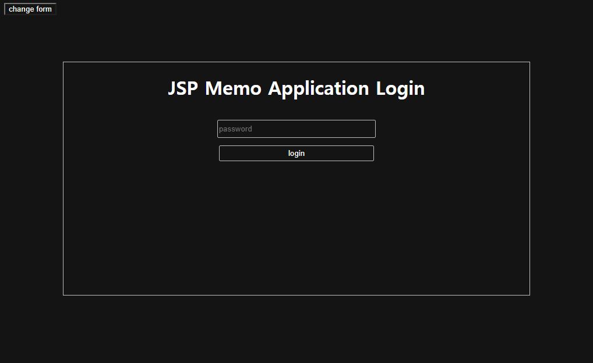
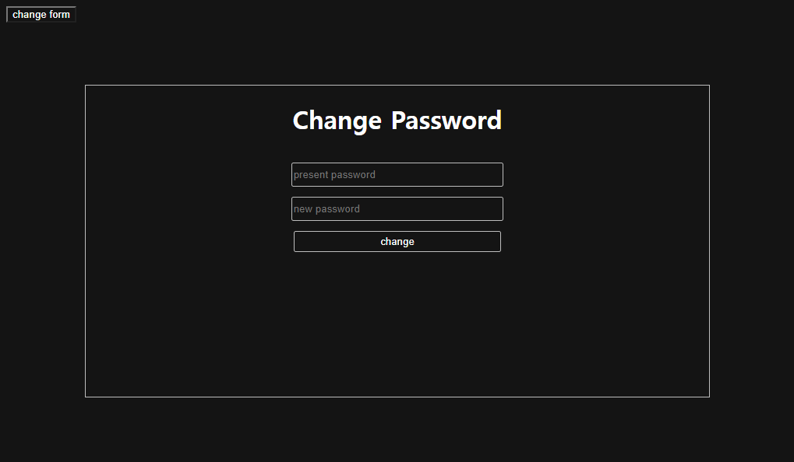
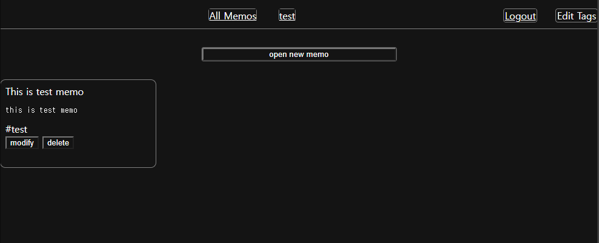
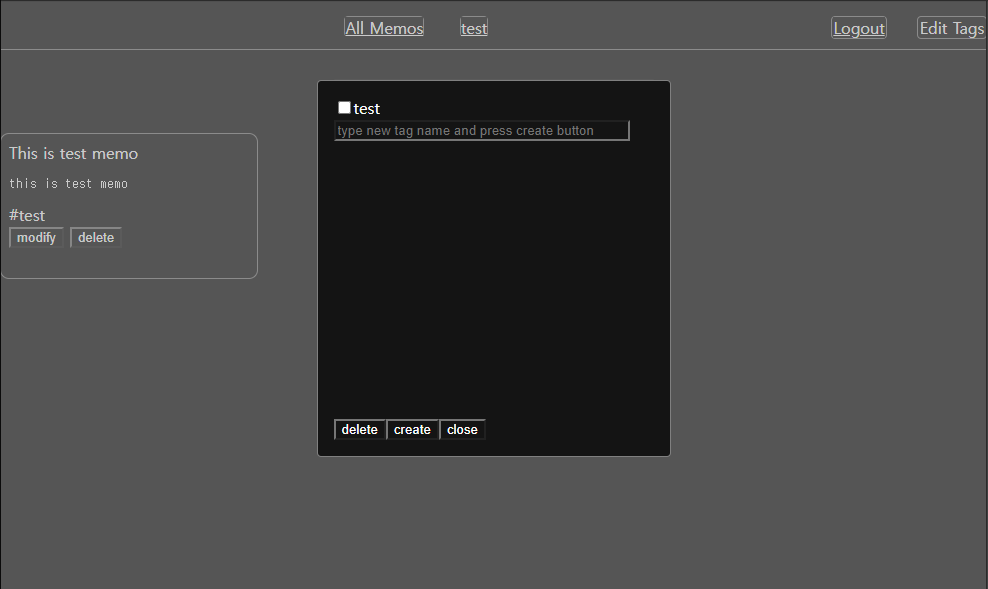
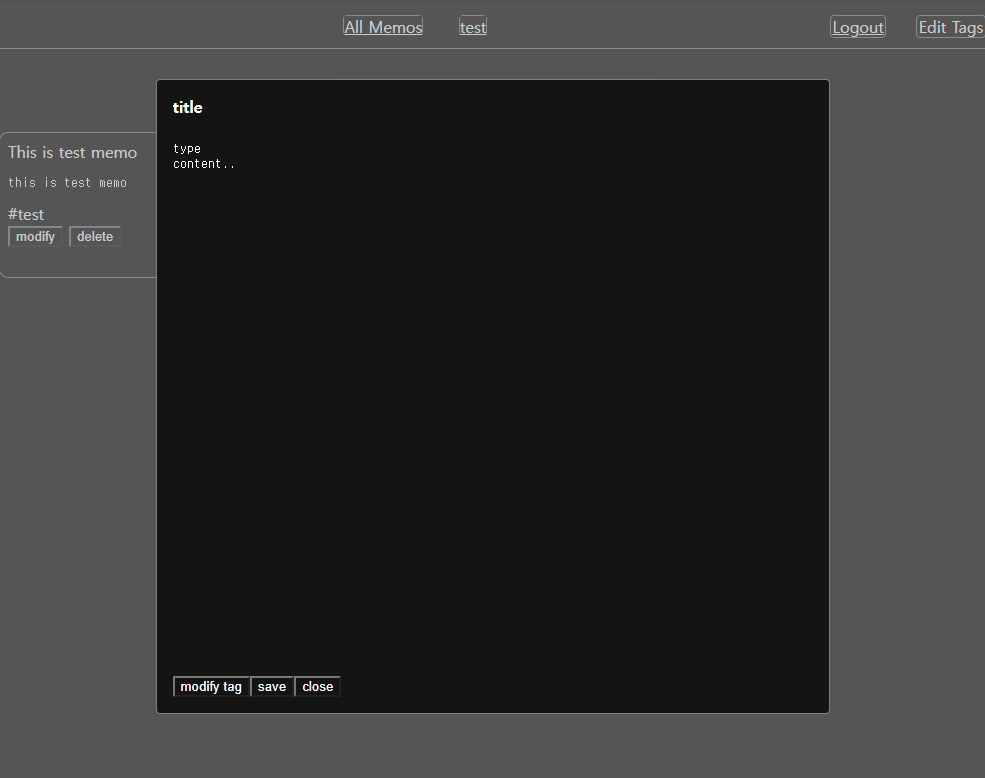

# JSP Memo Application
SQLite와 JSP & Servlet을 이용한 메모 애플리케이션.  
태그를 생성할 수 있고 각 태그별로 메모를 분류, 메모의 태그 편집등을 할 수 있다.  
* [설치방법]()
* [만들며 알게된것?]()
# Login Page
</img>
초기 로그인 암호는 `testpw`이다.  
좌측 상단의 `change form`버튼으로 로그인 암호 변경하는 폼으로 전환가능.  
</img>

# Memolist
</img>
로그인이 성공하게되면 모든 메모를 볼 수 있는 위의 페이지로 접속된다.  
  
__내비게이션바의 요소들__
* 가운데 태그들 - 가운데에 `All Memo`와 현재존재하는 태그들이 위치함.
각각을 누르면 해당 메모들의 페이지로 이동  
* `logout` - 누르면 로그아웃되며 로그인페이지로 로드됨.  
* `Edit Tags` - tag목록을 편집하는 창이 뜸.
</img>  
  
__다른 요소들__
* `memo` - 존재하는 메모들이 뜨며 `modify`와 `delete`를 통해 해당 작업가능.
* `open new memo` - 클릭하면 새로운 메모를 작성할 수 있는 창이 뜬다.
`modify tag`버튼을 통해 태그목록 수정가능.
</img>  
  
